# Scherbenwelten Karten

*[Diese Seite auf Deutsch](README.md)*

133 old islands from Scherbenwelten, ready for import into `world.map`.

Each `sql/<island>.sql` assumes the `world.map` / `world.map_name` schema already exists and is self-contained (allocates its own `karte_id`, so islands never collide with each other). Apply **[schema.sql](schema.sql)** once, then every `sql/*.sql` file in any order:

```bash
psql -d yourdb -f schema.sql
for f in sql/*.sql; do psql -d yourdb -f "$f"; done
```

## A´Mare t´Tini

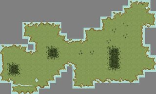

- **Land type:** ebene
- **Fields:** 300
- **Bounding box:** x 3144–3171, y -362–-346 (28×17)
- **SQL:** [A_Mare_t_Tini.sql](sql/A_Mare_t_Tini.sql)

## Amon Kardar

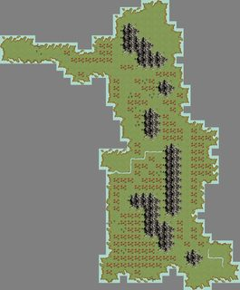

- **Land type:** ebene
- **Fields:** 598
- **Bounding box:** x 4827–4860, y -700–-660 (34×41)
- **SQL:** [Amon_Kardar.sql](sql/Amon_Kardar.sql)

## Arandor Vanenia

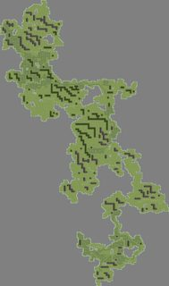

- **Land type:** ebene
- **Fields:** 12888
- **Bounding box:** x 3371–3535, y 507–786 (165×280)
- **SQL:** [Arandor_Vanenia.sql](sql/Arandor_Vanenia.sql)

## Arboleda Kardar

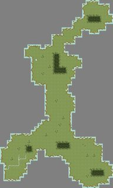

- **Land type:** ebene
- **Fields:** 736
- **Bounding box:** x 4827–4859, y -876–-822 (33×55)
- **SQL:** [Arboleda_Kardar.sql](sql/Arboleda_Kardar.sql)

## Archipel Romantika

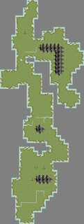

- **Land type:** ebene
- **Fields:** 597
- **Bounding box:** x 4942–4963, y -516–-459 (22×58)
- **SQL:** [Archipel_Romantika.sql](sql/Archipel_Romantika.sql)

## Armenia

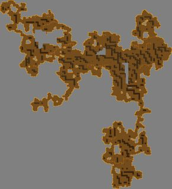

- **Land type:** lava
- **Fields:** 12808
- **Bounding box:** x 3807–4003, y 1703–1919 (197×217)
- **SQL:** [Armenia.sql](sql/Armenia.sql)

## Bendurs Strand

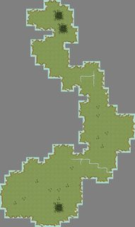

- **Land type:** ebene
- **Fields:** 671
- **Bounding box:** x 3024–3054, y -553–-502 (31×52)
- **SQL:** [Bendurs_Strand.sql](sql/Bendurs_Strand.sql)

## Bumsfaldera

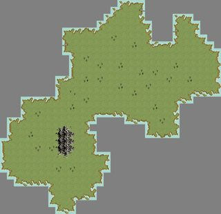

- **Land type:** ebene
- **Fields:** 499
- **Bounding box:** x 4365–4396, y -587–-557 (32×31)
- **SQL:** [Bumsfaldera.sql](sql/Bumsfaldera.sql)

## Calen Kardar

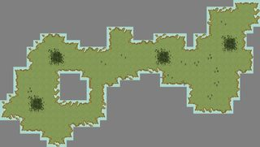

- **Land type:** ebene
- **Fields:** 403
- **Bounding box:** x 4727–4765, y -449–-428 (39×22)
- **SQL:** [Calen_Kardar.sql](sql/Calen_Kardar.sql)

## Caligo

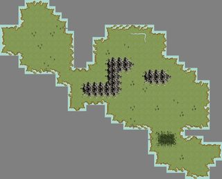

- **Land type:** ebene
- **Fields:** 469
- **Bounding box:** x 4432–4467, y 1275–1303 (36×29)
- **SQL:** [Caligo.sql](sql/Caligo.sql)

## Cap Púccino

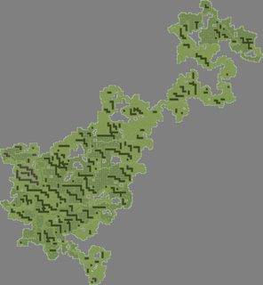

- **Land type:** ebene
- **Fields:** 15676
- **Bounding box:** x 3213–3444, y -636–-386 (232×251)
- **SQL:** [Cap_P_ccino.sql](sql/Cap_P_ccino.sql)

## Carpe Diem

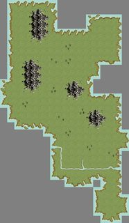

- **Land type:** ebene
- **Fields:** 354
- **Bounding box:** x 3602–3619, y 1401–1431 (18×31)
- **SQL:** [Carpe_Diem.sql](sql/Carpe_Diem.sql)

## Catan

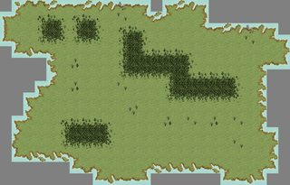

- **Land type:** ebene
- **Fields:** 327
- **Bounding box:** x 5044–5068, y 1673–1688 (25×16)
- **SQL:** [Catan.sql](sql/Catan.sql)

## Drachenbrandung

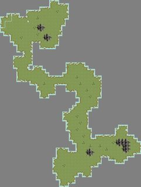

- **Land type:** ebene
- **Fields:** 782
- **Bounding box:** x 3447–3489, y 1313–1369 (43×57)
- **SQL:** [Drachenbrandung.sql](sql/Drachenbrandung.sql)

## Drachenfels

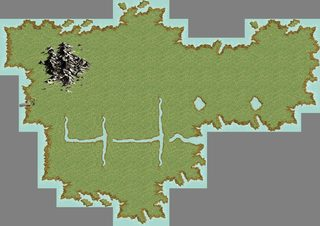

- **Land type:** ebene
- **Fields:** 134
- **Bounding box:** x 3417–3433, y 1382–1393 (17×12)
- **SQL:** [Drachenfels.sql](sql/Drachenfels.sql)

## Edubo

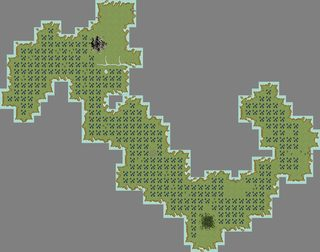

- **Land type:** ebene
- **Fields:** 623
- **Bounding box:** x 3240–3286, y 978–1014 (47×37)
- **SQL:** [Edubo.sql](sql/Edubo.sql)

## Eiland

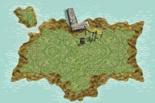

- **Land type:** ebene
- **Fields:** 6
- **Bounding box:** x 4249–4251, y 1050–1051 (3×2)
- **SQL:** [Eiland.sql](sql/Eiland.sql)

## Eisbeerchenland

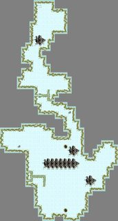

- **Land type:** ice
- **Fields:** 622
- **Bounding box:** x 3902–3929, y -984–-933 (28×52)
- **SQL:** [Eisbeerchenland.sql](sql/Eisbeerchenland.sql)

## Ennos Felsen

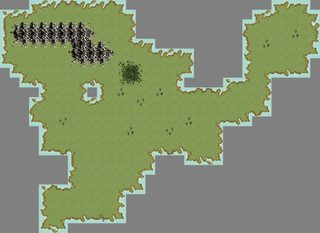

- **Land type:** ebene
- **Fields:** 430
- **Bounding box:** x 3028–3060, y 613–636 (33×24)
- **SQL:** [Ennos_Felsen.sql](sql/Ennos_Felsen.sql)

## Enoîki

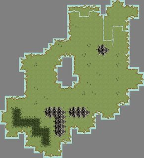

- **Land type:** ebene
- **Fields:** 568
- **Bounding box:** x 4795–4824, y 1375–1407 (30×33)
- **SQL:** [Eno_ki.sql](sql/Eno_ki.sql)

## Enten Auen

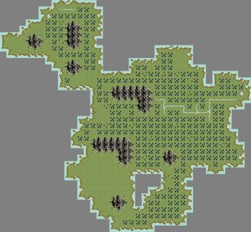

- **Land type:** ebene
- **Fields:** 702
- **Bounding box:** x 3230–3268, y -262–-227 (39×36)
- **SQL:** [Enten_Auen.sql](sql/Enten_Auen.sql)

## Feuersteppe

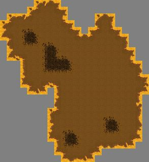

- **Land type:** lava
- **Fields:** 339
- **Bounding box:** x 4730–4751, y 1706–1729 (22×24)
- **SQL:** [Feuersteppe.sql](sql/Feuersteppe.sql)

## Fisherman´s Friend

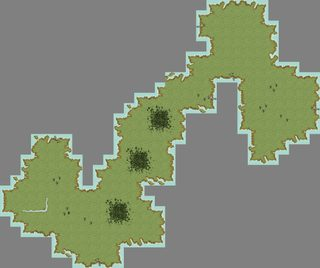

- **Land type:** ebene
- **Fields:** 321
- **Bounding box:** x 4309–4339, y 919–944 (31×26)
- **SQL:** [Fisherman_s_Friend.sql](sql/Fisherman_s_Friend.sql)

## Flatterfels

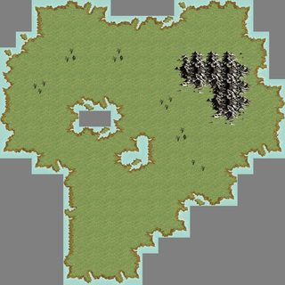

- **Land type:** ebene
- **Fields:** 230
- **Bounding box:** x 4625–4642, y -790–-773 (18×18)
- **SQL:** [Flatterfels.sql](sql/Flatterfels.sql)

## Geisterinsel

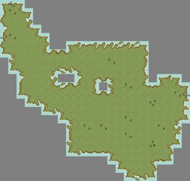

- **Land type:** ebene
- **Fields:** 274
- **Bounding box:** x 3401–3423, y -431–-410 (23×22)
- **SQL:** [Geisterinsel.sql](sql/Geisterinsel.sql)

## Golden Isle

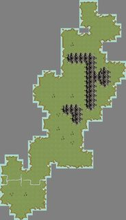

- **Land type:** ebene
- **Fields:** 546
- **Bounding box:** x 3658–3684, y 434–480 (27×47)
- **SQL:** [Golden_Isle.sql](sql/Golden_Isle.sql)

## großes heißes Plätteisen

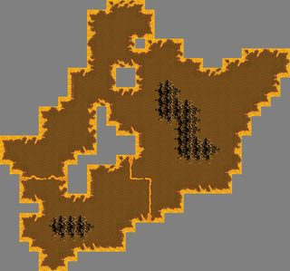

- **Land type:** lava
- **Fields:** 428
- **Bounding box:** x 4698–4727, y 1792–1819 (30×28)
- **SQL:** [gro_es_hei_es_Pl_tteisen.sql](sql/gro_es_hei_es_Pl_tteisen.sql)

## Hafeninsel

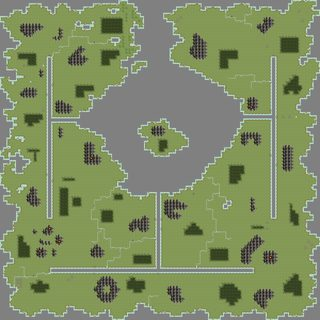

- **Land type:** ebene
- **Fields:** 7526
- **Bounding box:** x 4201–4300, y 501–600 (100×100)
- **SQL:** [Hafeninsel.sql](sql/Hafeninsel.sql)

## Insel der Blitze

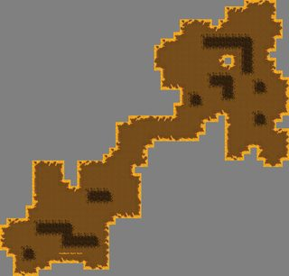

- **Land type:** lava
- **Fields:** 709
- **Bounding box:** x 4155–4199, y 1581–1623 (45×43)
- **SQL:** [Insel_der_Blitze.sql](sql/Insel_der_Blitze.sql)

## Insel der Hoffnung

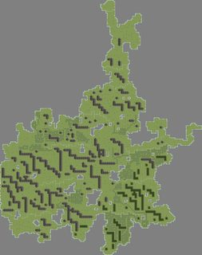

- **Land type:** ebene
- **Fields:** 11972
- **Bounding box:** x 3002–3152, y 420–610 (151×191)
- **SQL:** [Insel_der_Hoffnung.sql](sql/Insel_der_Hoffnung.sql)

## Insel der Trostlosigkeit

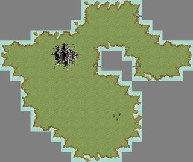

- **Land type:** ebene
- **Fields:** 179
- **Bounding box:** x 3574–3592, y -871–-856 (19×16)
- **SQL:** [Insel_der_Trostlosigkeit.sql](sql/Insel_der_Trostlosigkeit.sql)

## Insel der verlorenen Wespen

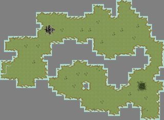

- **Land type:** ebene
- **Fields:** 706
- **Bounding box:** x 4682–4722, y 721–750 (41×30)
- **SQL:** [Insel_der_verlorenen_Wespen.sql](sql/Insel_der_verlorenen_Wespen.sql)

## Insel Emma

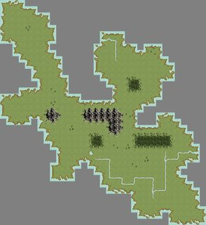

- **Land type:** ebene
- **Fields:** 596
- **Bounding box:** x 4462–4494, y -245–-210 (33×36)
- **SQL:** [Insel_Emma.sql](sql/Insel_Emma.sql)

## Inutile

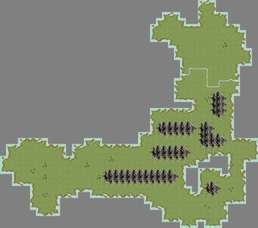

- **Land type:** ebene
- **Fields:** 703
- **Bounding box:** x 3593–3635, y 841–878 (43×38)
- **SQL:** [Inutile.sql](sql/Inutile.sql)

## Isla de Muerta

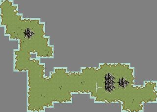

- **Land type:** ebene
- **Fields:** 337
- **Bounding box:** x 4922–4956, y 970–994 (35×25)
- **SQL:** [Isla_de_Muerta.sql](sql/Isla_de_Muerta.sql)

## Isle of Death

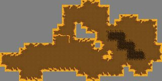

- **Land type:** lava
- **Fields:** 351
- **Bounding box:** x 3280–3313, y 1579–1595 (34×17)
- **SQL:** [Isle_of_Death.sql](sql/Isle_of_Death.sql)

## Isle of Horror

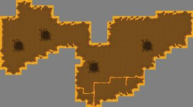

- **Land type:** lava
- **Fields:** 388
- **Bounding box:** x 3009–3044, y 1638–1657 (36×20)
- **SQL:** [Isle_of_Horror.sql](sql/Isle_of_Horror.sql)

## Isle of Pain

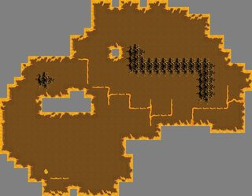

- **Land type:** lava
- **Fields:** 635
- **Bounding box:** x 3313–3348, y 1507–1534 (36×28)
- **SQL:** [Isle_of_Pain.sql](sql/Isle_of_Pain.sql)

## Isle of Terror

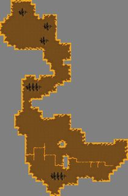

- **Land type:** lava
- **Fields:** 761
- **Bounding box:** x 3200–3235, y 1492–1546 (36×55)
- **SQL:** [Isle_of_Terror.sql](sql/Isle_of_Terror.sql)

## Isola La Speranza

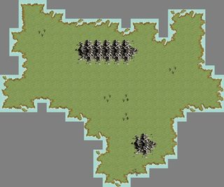

- **Land type:** ebene
- **Fields:** 295
- **Bounding box:** x 4420–4443, y -567–-548 (24×20)
- **SQL:** [Isola_La_Speranza.sql](sql/Isola_La_Speranza.sql)

## Kanubia

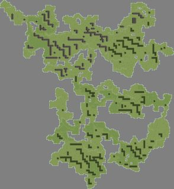

- **Land type:** ebene
- **Fields:** 13694
- **Bounding box:** x 3987–4159, y -786–-599 (173×188)
- **SQL:** [Kanubia.sql](sql/Kanubia.sql)

## Kathodos

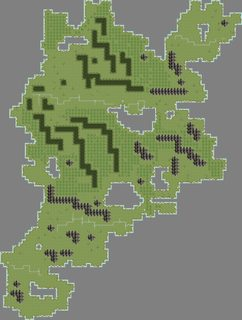

- **Land type:** ebene
- **Fields:** 4184
- **Bounding box:** x 3765–3842, y -28–74 (78×103)
- **SQL:** [Kathodos.sql](sql/Kathodos.sql)

## Klein Loh

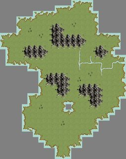

- **Land type:** ebene
- **Fields:** 425
- **Bounding box:** x 4356–4378, y -465–-437 (23×29)
- **SQL:** [Klein_Loh.sql](sql/Klein_Loh.sql)

## kleine Ölinsel der Hoffnung

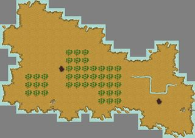

- **Land type:** desert
- **Fields:** 261
- **Bounding box:** x 3305–3328, y 1249–1265 (24×17)
- **SQL:** [kleine_linsel_der_Hoffnung.sql](sql/kleine_linsel_der_Hoffnung.sql)

## kleines heißes Plätteisen

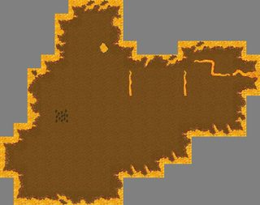

- **Land type:** lava
- **Fields:** 180
- **Bounding box:** x 4535–4553, y 1874–1888 (19×15)
- **SQL:** [kleines_hei_es_Pl_tteisen.sql](sql/kleines_hei_es_Pl_tteisen.sql)

## Kleinkräutergarten

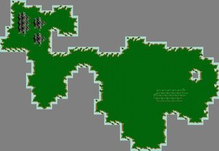

- **Land type:** jungle
- **Fields:** 585
- **Bounding box:** x 5030–5071, y 1872–1900 (42×29)
- **SQL:** [Kleinkr_utergarten.sql](sql/Kleinkr_utergarten.sql)

## Kontinent Loh

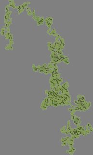

- **Land type:** ebene
- **Fields:** 34951
- **Bounding box:** x 4031–4384, y -558–27 (354×586)
- **SQL:** [Kontinent_Loh.sql](sql/Kontinent_Loh.sql)

## Korona

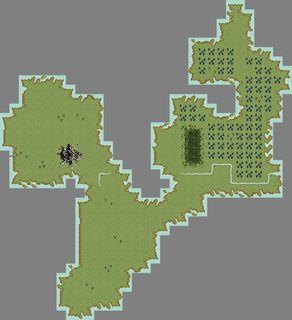

- **Land type:** ebene
- **Fields:** 450
- **Bounding box:** x 3709–3739, y 513–546 (31×34)
- **SQL:** [Korona.sql](sql/Korona.sql)

## Kräutergarten

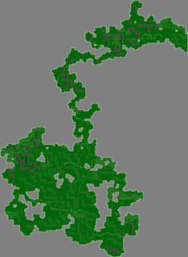

- **Land type:** jungle
- **Fields:** 12657
- **Bounding box:** x 5067–5239, y 1713–1949 (173×237)
- **SQL:** [Kr_utergarten.sql](sql/Kr_utergarten.sql)

## Kyll

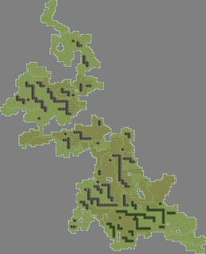

- **Land type:** ebene
- **Fields:** 6538
- **Bounding box:** x 4593–4725, y -252–-89 (133×164)
- **SQL:** [Kyll.sql](sql/Kyll.sql)

## L´Île de la Resistance


- **Land type:** ebene
- **Fields:** 451
- **Bounding box:** x 4915–4946, y -69–-48 (32×22)
- **SQL:** [L_le_de_la_Resistance.sql](sql/L_le_de_la_Resistance.sql)

## L´Isola Rocciosa


- **Land type:** ebene
- **Fields:** 871
- **Bounding box:** x 3542–3579, y 900–947 (38×48)
- **SQL:** [L_Isola_Rocciosa.sql](sql/L_Isola_Rocciosa.sql)

## Lagerinsel


- **Land type:** ebene
- **Fields:** 51036
- **Bounding box:** x 4099–4588, y 184–791 (490×608)
- **SQL:** [Lagerinsel.sql](sql/Lagerinsel.sql)

## Land's End


- **Land type:** lava
- **Fields:** 515
- **Bounding box:** x 3115–3156, y 1972–1999 (42×28)
- **SQL:** [Land_s_End.sql](sql/Land_s_End.sql)

## Little Ferieninsel


- **Land type:** lava
- **Fields:** 173
- **Bounding box:** x 3680–3696, y 1668–1685 (17×18)
- **SQL:** [Little_Ferieninsel.sql](sql/Little_Ferieninsel.sql)

## Lóna Linwilóce


- **Land type:** ebene
- **Fields:** 288
- **Bounding box:** x 3091–3119, y 776–792 (29×17)
- **SQL:** [L_na_Linwil_ce.sql](sql/L_na_Linwil_ce.sql)

## Long Island


- **Land type:** ebene
- **Fields:** 13174
- **Bounding box:** x 3480–3683, y 1023–1200 (204×178)
- **SQL:** [Long_Island.sql](sql/Long_Island.sql)

## Lummerland


- **Land type:** ebene
- **Fields:** 442
- **Bounding box:** x 3580–3604, y 242–266 (25×25)
- **SQL:** [Lummerland.sql](sql/Lummerland.sql)

## Lunaé


- **Land type:** ebene
- **Fields:** 583
- **Bounding box:** x 3040–3076, y -685–-640 (37×46)
- **SQL:** [Luna.sql](sql/Luna.sql)

## Mamenka


- **Land type:** lava
- **Fields:** 1209
- **Bounding box:** x 4068–4122, y 1693–1730 (55×38)
- **SQL:** [Mamenka.sql](sql/Mamenka.sql)

## Margaritha


- **Land type:** ebene
- **Fields:** 184
- **Bounding box:** x 4899–4911, y 219–238 (13×20)
- **SQL:** [Margaritha.sql](sql/Margaritha.sql)

## Marius Alvarez


- **Land type:** ebene
- **Fields:** 110
- **Bounding box:** x 4944–4957, y 54–64 (14×11)
- **SQL:** [Marius_Alvarez.sql](sql/Marius_Alvarez.sql)

## Mark el Ferror


- **Land type:** ebene
- **Fields:** 779
- **Bounding box:** x 5031–5075, y -605–-569 (45×37)
- **SQL:** [Mark_el_Ferror.sql](sql/Mark_el_Ferror.sql)

## Matmeral


- **Land type:** ebene
- **Fields:** 758
- **Bounding box:** x 3907–3943, y 18–66 (37×49)
- **SQL:** [Matmeral.sql](sql/Matmeral.sql)

## Mauremys Leprosa


- **Land type:** ebene
- **Fields:** 406
- **Bounding box:** x 5043–5073, y -420–-399 (31×22)
- **SQL:** [Mauremys_Leprosa.sql](sql/Mauremys_Leprosa.sql)

## Meklunia


- **Land type:** desert
- **Fields:** 768
- **Bounding box:** x 3943–4002, y 1098–1133 (60×36)
- **SQL:** [Meklunia.sql](sql/Meklunia.sql)

## namenlose Insel 3010/450


- **Land type:** ebene
- **Fields:** 518
- **Bounding box:** x 3002–3030, y 435–465 (29×31)
- **SQL:** [namenlose_Insel_3010_450.sql](sql/namenlose_Insel_3010_450.sql)

## namenlose Insel 3430/1270


- **Land type:** ebene
- **Fields:** 373
- **Bounding box:** x 3419–3438, y 1255–1282 (20×28)
- **SQL:** [namenlose_Insel_3430_1270.sql](sql/namenlose_Insel_3430_1270.sql)

## namenlose Insel 4590/-200


- **Land type:** ebene
- **Fields:** 15
- **Bounding box:** x 4588–4592, y -221–-219 (5×3)
- **SQL:** [namenlose_Insel_4590_200.sql](sql/namenlose_Insel_4590_200.sql)

## namenlose Insel ohne Anleger 3010/-650


- **Land type:** ebene
- **Fields:** 133
- **Bounding box:** x 3002–3014, y -652–-639 (13×14)
- **SQL:** [namenlose_Insel_ohne_Anleger_3010_650.sql](sql/namenlose_Insel_ohne_Anleger_3010_650.sql)

## namenlose Insel ohne Anleger 3430/-150


- **Land type:** ebene
- **Fields:** 284
- **Bounding box:** x 3419–3436, y -160–-133 (18×28)
- **SQL:** [namenlose_Insel_ohne_Anleger_3430_150.sql](sql/namenlose_Insel_ohne_Anleger_3430_150.sql)

## namenlose Insel ohne Anleger 3590/630


- **Land type:** ebene
- **Fields:** 298
- **Bounding box:** x 3568–3594, y 620–648 (27×29)
- **SQL:** [namenlose_Insel_ohne_Anleger_3590_630.sql](sql/namenlose_Insel_ohne_Anleger_3590_630.sql)

## namenlose Insel ohne Anleger 3710/590


- **Land type:** ebene
- **Fields:** 227
- **Bounding box:** x 3703–3724, y 582–601 (22×20)
- **SQL:** [namenlose_Insel_ohne_Anleger_3710_590.sql](sql/namenlose_Insel_ohne_Anleger_3710_590.sql)

## namenlose Insel ohne Anleger 3960/-580


- **Land type:** ebene
- **Fields:** 81
- **Bounding box:** x 3961–3969, y -585–-574 (9×12)
- **SQL:** [namenlose_Insel_ohne_Anleger_3960_580.sql](sql/namenlose_Insel_ohne_Anleger_3960_580.sql)

## namenlose Insel ohne Anleger 4050/-970


- **Land type:** ebene
- **Fields:** 172
- **Bounding box:** x 4036–4052, y -981–-967 (17×15)
- **SQL:** [namenlose_Insel_ohne_Anleger_4050_970.sql](sql/namenlose_Insel_ohne_Anleger_4050_970.sql)

## namenlose Insel ohne Anleger 4850/-590


- **Land type:** ebene
- **Fields:** 168
- **Bounding box:** x 4845–4857, y -598–-580 (13×19)
- **SQL:** [namenlose_Insel_ohne_Anleger_4850_590.sql](sql/namenlose_Insel_ohne_Anleger_4850_590.sql)

## namenlose Insel ohne Anleger 5170/10


- **Land type:** ebene
- **Fields:** 148
- **Bounding box:** x 5159–5171, y 6–21 (13×16)
- **SQL:** [namenlose_Insel_ohne_Anleger_5170_10.sql](sql/namenlose_Insel_ohne_Anleger_5170_10.sql)

## namenlose Insel ohne Anleger 5180/-70


- **Land type:** ebene
- **Fields:** 186
- **Bounding box:** x 5169–5184, y -74–-57 (16×18)
- **SQL:** [namenlose_Insel_ohne_Anleger_5180_70.sql](sql/namenlose_Insel_ohne_Anleger_5180_70.sql)

## namenlose Lavainsel 3300/1710


- **Land type:** lava
- **Fields:** 486
- **Bounding box:** x 3286–3315, y 1704–1730 (30×27)
- **SQL:** [namenlose_Lavainsel_3300_1710.sql](sql/namenlose_Lavainsel_3300_1710.sql)

## namenlose Lavainsel 3330/1710


- **Land type:** lava
- **Fields:** 205
- **Bounding box:** x 3321–3340, y 1704–1718 (20×15)
- **SQL:** [namenlose_Lavainsel_3330_1710.sql](sql/namenlose_Lavainsel_3330_1710.sql)

## namenlose Lavainsel 3360/1790


- **Land type:** lava
- **Fields:** 610
- **Bounding box:** x 3343–3381, y 1781–1806 (39×26)
- **SQL:** [namenlose_Lavainsel_3360_1790.sql](sql/namenlose_Lavainsel_3360_1790.sql)

## namenlose Lavainsel 3910/1650


- **Land type:** lava
- **Fields:** 295
- **Bounding box:** x 3896–3918, y 1640–1659 (23×20)
- **SQL:** [namenlose_Lavainsel_3910_1650.sql](sql/namenlose_Lavainsel_3910_1650.sql)

## namenlose Lavainsel 4220/1880


- **Land type:** lava
- **Fields:** 604
- **Bounding box:** x 4203–4235, y 1870–1900 (33×31)
- **SQL:** [namenlose_Lavainsel_4220_1880.sql](sql/namenlose_Lavainsel_4220_1880.sql)

## namenlose Lavainsel 4400/1510


- **Land type:** lava
- **Fields:** 239
- **Bounding box:** x 4394–4412, y 1502–1524 (19×23)
- **SQL:** [namenlose_Lavainsel_4400_1510.sql](sql/namenlose_Lavainsel_4400_1510.sql)

## namenlose Lavainsel 4470/1510


- **Land type:** lava
- **Fields:** 239
- **Bounding box:** x 4394–4412, y 1502–1524 (19×23)
- **SQL:** [namenlose_Lavainsel_4470_1510.sql](sql/namenlose_Lavainsel_4470_1510.sql)

## namenlose Lavainsel 4570/1970


- **Land type:** lava
- **Fields:** 734
- **Bounding box:** x 4535–4577, y 1953–1988 (43×36)
- **SQL:** [namenlose_Lavainsel_4570_1970.sql](sql/namenlose_Lavainsel_4570_1970.sql)

## namenlose Lavainsel 4660/1650


- **Land type:** lava
- **Fields:** 787
- **Bounding box:** x 4631–4693, y 1634–1655 (63×22)
- **SQL:** [namenlose_Lavainsel_4660_1650.sql](sql/namenlose_Lavainsel_4660_1650.sql)

## namenlose Lavainsel 4690/1550


- **Land type:** lava
- **Fields:** 352
- **Bounding box:** x 4678–4700, y 1535–1566 (23×32)
- **SQL:** [namenlose_Lavainsel_4690_1550.sql](sql/namenlose_Lavainsel_4690_1550.sql)

## Naphtha


- **Land type:** ebene
- **Fields:** 289
- **Bounding box:** x 3809–3825, y 1261–1288 (17×28)
- **SQL:** [Naphtha.sql](sql/Naphtha.sql)

## Nebelinsel


- **Land type:** ebene
- **Fields:** 527
- **Bounding box:** x 4703–4727, y 649–681 (25×33)
- **SQL:** [Nebelinsel.sql](sql/Nebelinsel.sql)

## Neldoreth


- **Land type:** ebene
- **Fields:** 5557
- **Bounding box:** x 3222–3419, y 689–815 (198×127)
- **SQL:** [Neldoreth.sql](sql/Neldoreth.sql)

## Nesheia Musin


- **Land type:** ebene
- **Fields:** 382
- **Bounding box:** x 3945–3976, y -203–-178 (32×26)
- **SQL:** [Nesheia_Musin.sql](sql/Nesheia_Musin.sql)

## Nöldtwin


- **Land type:** desert
- **Fields:** 624
- **Bounding box:** x 3625–3677, y 1241–1270 (53×30)
- **SQL:** [N_ldtwin.sql](sql/N_ldtwin.sql)

## Ölinsel der Hoffnung


- **Land type:** desert
- **Fields:** 10344
- **Bounding box:** x 3038–3205, y 1196–1369 (168×174)
- **SQL:** [linsel_der_Hoffnung.sql](sql/linsel_der_Hoffnung.sql)

## Osterinsel


- **Land type:** ebene
- **Fields:** 244
- **Bounding box:** x 4036–4054, y 1390–1413 (19×24)
- **SQL:** [Osterinsel.sql](sql/Osterinsel.sql)

## På min måte


- **Land type:** ebene
- **Fields:** 839
- **Bounding box:** x 5099–5139, y 1005–1045 (41×41)
- **SQL:** [P_min_m_te.sql](sql/P_min_m_te.sql)

## Petroleuminsel


- **Land type:** desert
- **Fields:** 20262
- **Bounding box:** x 3862–4247, y 1124–1319 (386×196)
- **SQL:** [Petroleuminsel.sql](sql/Petroleuminsel.sql)

## Phantasy Island


- **Land type:** lava
- **Fields:** 722
- **Bounding box:** x 3613–3659, y 1511–1561 (47×51)
- **SQL:** [Phantasy_Island.sql](sql/Phantasy_Island.sql)

## Phileaswüste


- **Land type:** desert
- **Fields:** 673
- **Bounding box:** x 4388–4445, y 1308–1348 (58×41)
- **SQL:** [Phileasw_ste.sql](sql/Phileasw_ste.sql)

## Punschel


- **Land type:** ice
- **Fields:** 756
- **Bounding box:** x 4700–4735, y -822–-779 (36×44)
- **SQL:** [Punschel.sql](sql/Punschel.sql)

## Riva


- **Land type:** ebene
- **Fields:** 565
- **Bounding box:** x 3686–3716, y 214–254 (31×41)
- **SQL:** [Riva.sql](sql/Riva.sql)

## Rumkugel


- **Land type:** ebene
- **Fields:** 294
- **Bounding box:** x 4865–4885, y -849–-826 (21×24)
- **SQL:** [Rumkugel.sql](sql/Rumkugel.sql)

## Rygg til Sjøen


- **Land type:** ebene
- **Fields:** 586
- **Bounding box:** x 5178–5219, y 734–761 (42×28)
- **SQL:** [Rygg_til_Sj_en.sql](sql/Rygg_til_Sj_en.sql)

## San Torin


- **Land type:** lava
- **Fields:** 615
- **Bounding box:** x 4087–4118, y 1463–1495 (32×33)
- **SQL:** [San_Torin.sql](sql/San_Torin.sql)

## Sanryati


- **Land type:** ebene
- **Fields:** 695
- **Bounding box:** x 4485–4528, y 1447–1483 (44×37)
- **SQL:** [Sanryati.sql](sql/Sanryati.sql)

## Schmeidiländ


- **Land type:** ebene
- **Fields:** 374
- **Bounding box:** x 4514–4532, y 92–123 (19×32)
- **SQL:** [Schmeidil_nd.sql](sql/Schmeidil_nd.sql)

## Seeinsel


- **Land type:** ebene
- **Fields:** 398
- **Bounding box:** x 3593–3632, y -255–-226 (40×30)
- **SQL:** [Seeinsel.sql](sql/Seeinsel.sql)

## Seemannsgrab


- **Land type:** lava
- **Fields:** 8845
- **Bounding box:** x 3536–3689, y 1606–1802 (154×197)
- **SQL:** [Seemannsgrab.sql](sql/Seemannsgrab.sql)

## Skutt Kanin


- **Land type:** ebene
- **Fields:** 361
- **Bounding box:** x 4654–4675, y 1152–1179 (22×28)
- **SQL:** [Skutt_Kanin.sql](sql/Skutt_Kanin.sql)

## Söldtwin


- **Land type:** desert
- **Fields:** 266
- **Bounding box:** x 3629–3648, y 1294–1314 (20×21)
- **SQL:** [S_ldtwin.sql](sql/S_ldtwin.sql)

## Solitaria


- **Land type:** ebene
- **Fields:** 107
- **Bounding box:** x 3183–3196, y 333–342 (14×10)
- **SQL:** [Solitaria.sql](sql/Solitaria.sql)

## Sonnensteppe


- **Land type:** lava,ebene
- **Fields:** 22447
- **Bounding box:** x 4718–5226, y 1468–1701 (509×234)
- **SQL:** [Sonnensteppe.sql](sql/Sonnensteppe.sql)

## Sonnwend


- **Land type:** ebene
- **Fields:** 451
- **Bounding box:** x 3367–3388, y -717–-682 (22×36)
- **SQL:** [Sonnwend.sql](sql/Sonnwend.sql)

## Steinöde


- **Land type:** ebene
- **Fields:** 585
- **Bounding box:** x 4636–4664, y -770–-738 (29×33)
- **SQL:** [Stein_de.sql](sql/Stein_de.sql)

## Stern des Westens


- **Land type:** ebene
- **Fields:** 594
- **Bounding box:** x 3976–4018, y 690–713 (43×24)
- **SQL:** [Stern_des_Westens.sql](sql/Stern_des_Westens.sql)

## Stille Zuflucht


- **Land type:** ebene
- **Fields:** 472
- **Bounding box:** x 3557–3585, y 59–89 (29×31)
- **SQL:** [Stille_Zuflucht.sql](sql/Stille_Zuflucht.sql)

## Sturmfels


- **Land type:** ebene
- **Fields:** 663
- **Bounding box:** x 3322–3342, y 229–290 (21×62)
- **SQL:** [Sturmfels.sql](sql/Sturmfels.sql)

## Sturmforst


- **Land type:** ebene
- **Fields:** 275
- **Bounding box:** x 3304–3331, y 102–118 (28×17)
- **SQL:** [Sturmforst.sql](sql/Sturmforst.sql)

## Süderinsel


- **Land type:** lava
- **Fields:** 277
- **Bounding box:** x 4034–4048, y 1500–1526 (15×27)
- **SQL:** [S_derinsel.sql](sql/S_derinsel.sql)

## Tadmor Insel


- **Land type:** ebene
- **Fields:** 648
- **Bounding box:** x 4939–4977, y 147–184 (39×38)
- **SQL:** [Tadmor_Insel.sql](sql/Tadmor_Insel.sql)

## Taka Tuka


- **Land type:** ebene
- **Fields:** 790
- **Bounding box:** x 4401–4461, y 1125–1167 (61×43)
- **SQL:** [Taka_Tuka.sql](sql/Taka_Tuka.sql)

## Terra Arena


- **Land type:** desert
- **Fields:** 473
- **Bounding box:** x 4938–4968, y 1243–1267 (31×25)
- **SQL:** [Terra_Arena.sql](sql/Terra_Arena.sql)

## Tol Aldar


- **Land type:** ebene
- **Fields:** 864
- **Bounding box:** x 4218–4262, y 44–86 (45×43)
- **SQL:** [Tol_Aldar.sql](sql/Tol_Aldar.sql)

## Tol Avari


- **Land type:** ebene
- **Fields:** 409
- **Bounding box:** x 4229–4258, y 146–180 (30×35)
- **SQL:** [Tol_Avari.sql](sql/Tol_Avari.sql)

## Tol in Mar


- **Land type:** ebene
- **Fields:** 7666
- **Bounding box:** x 4940–5113, y 676–806 (174×131)
- **SQL:** [Tol_in_Mar.sql](sql/Tol_in_Mar.sql)

## Tol Saldor


- **Land type:** ebene
- **Fields:** 504
- **Bounding box:** x 3444–3482, y -63–-17 (39×47)
- **SQL:** [Tol_Saldor.sql](sql/Tol_Saldor.sql)

## Treibholz


- **Land type:** ebene
- **Fields:** 346
- **Bounding box:** x 4309–4335, y 1163–1194 (27×32)
- **SQL:** [Treibholz.sql](sql/Treibholz.sql)

## Trithales


- **Land type:** ebene
- **Fields:** 726
- **Bounding box:** x 4033–4065, y -896–-855 (33×42)
- **SQL:** [Trithales.sql](sql/Trithales.sql)

## Tynd Perth Kardar


- **Land type:** ebene
- **Fields:** 477
- **Bounding box:** x 3228–3270, y -627–-594 (43×34)
- **SQL:** [Tynd_Perth_Kardar.sql](sql/Tynd_Perth_Kardar.sql)

## Wildcats Island


- **Land type:** ebene
- **Fields:** 851
- **Bounding box:** x 3104–3163, y 86–117 (60×32)
- **SQL:** [Wildcats_Island.sql](sql/Wildcats_Island.sql)

## Wunschinsel der Hoffnung


- **Land type:** ebene
- **Fields:** 794
- **Bounding box:** x 3087–3131, y -191–-145 (45×47)
- **SQL:** [Wunschinsel_der_Hoffnung.sql](sql/Wunschinsel_der_Hoffnung.sql)

## Xentar


- **Land type:** ebene
- **Fields:** 788
- **Bounding box:** x 3979–4017, y 1026–1077 (39×52)
- **SQL:** [Xentar.sql](sql/Xentar.sql)

## Ynys Llanw A Thrai


- **Land type:** ebene
- **Fields:** 304
- **Bounding box:** x 3642–3664, y -408–-386 (23×23)
- **SQL:** [Ynys_Llanw_A_Thrai.sql](sql/Ynys_Llanw_A_Thrai.sql)
